# HealthMate

A mobile app for fitness enthusiasts to pin, discover, and manage workout spots, track calories and calculate nutrients.

---

## Features and Functionalities

- **User Authentication**
  - Register, login, and secure JWT-based authentication.
- **Profile Management**
  - View and update personal information and password.
- **Workout Spot Pinning**
  - Pin new workout locations with type, description, and coordinates.
  - View all your pinned spots.
- **Nearby Workout Spots**
  - Discover workout spots within 10 km of your current location.
- **Favorites**
  - Add any spot to your favorites with a heart button.
  - View and manage your list of favorite spots (add/remove).
- **Spot Details**
  - Tap any spot to view its full details.
- **Calories Burned Calculator**
  - Calculate calories burned based on duration, and heart rate zone.
- **Nutrient Calculator**
  - Calculate BMR, TDEE, and macronutrient breakdowns based on your profile and goals.
- **Navigation**
  - Bottom navigation bar for quick access to all main features.
- **Map Integration**
  - Visualize spots on a map (Google Maps for mobile, Leaflet for web).
- **Responsive UI**
  - Clean, mobile-friendly design.

---

## Installation Guide

### Prerequisites

- [Node.js](https://nodejs.org/) (v18+ recommended)
- [Expo CLI](https://docs.expo.dev/get-started/installation/)
- [Python 3.10+](https://www.python.org/downloads/)
- [MongoDB Atlas](https://www.mongodb.com/cloud/atlas) (or local MongoDB instance)
- [ngrok](https://ngrok.com/download) (for exposing local FastAPI backend)
- Android emulator (e.g., Android Studio)

---

### 1. Clone the Repository

```bash
git clone https://github.com/KikyoBRV/HealthMate.git
cd HealthMate
```

---

### 2. Frontend Setup (React Native + Expo)

```bash
cd frontend
npm install
```

- To run the app:
  ```bash
  npx expo start
  ```
- Press `a` to launch the app in the Android emulator (make sure it's running).
- Or scan the QR code with the Expo Go app on your Android/iOS device.

---

### 3. Backend Setup (FastAPI)

```bash
cd ../backend
python -m venv venv
source venv/bin/activate  # On Windows: venv\Scripts\activate
pip install -r requirements.txt
```

- Create a `.env` file in the `backend` directory with:
  ```
  MONGODB_URL=your_mongodb_connection_string
  ```

- Start the FastAPI server:
  ```bash
  uvicorn main:app --reload
  ```

---

### 4. Expose Backend with ngrok

While still in the `backend/` directory, run:

```bash
ngrok http 8000
```

- Copy the `https://...` **Forwarding URL** from ngrok's output.
- Update all `.js` files in the `frontend/app/` directory that contain `API_URL` (e.g., `workout-spot.js`, `my-pins.js`, etc.) by replacing the old URL with the new ngrok forwarding URL:
  ```js
  export const API_URL = "https://your-ngrok-url.ngrok.io";
  ```

---

# HealthMate UI

Below are all UI in the HealthMate project:

## Profile Handler Images
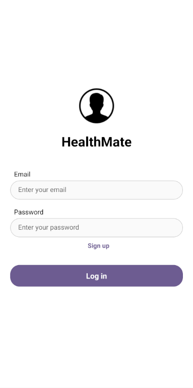


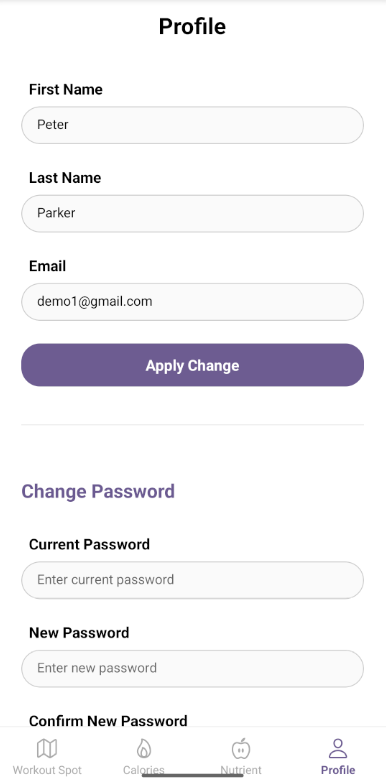


## Calories Burned Calculator Images
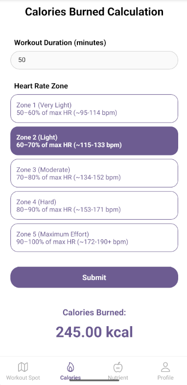

## Nutrient Calculator Images
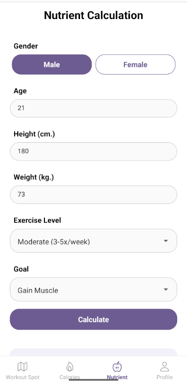


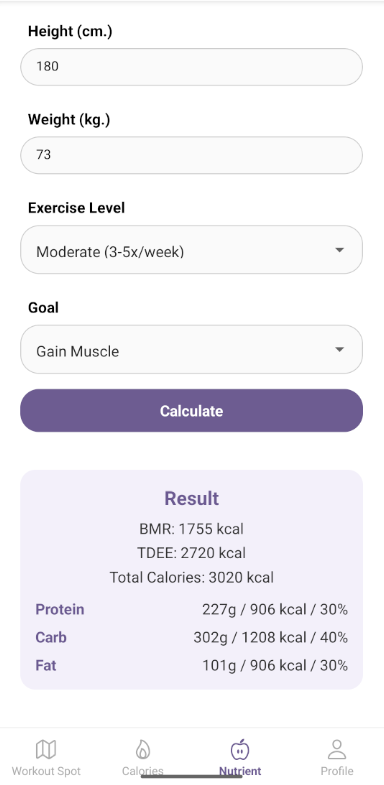

## Workout Spot Images
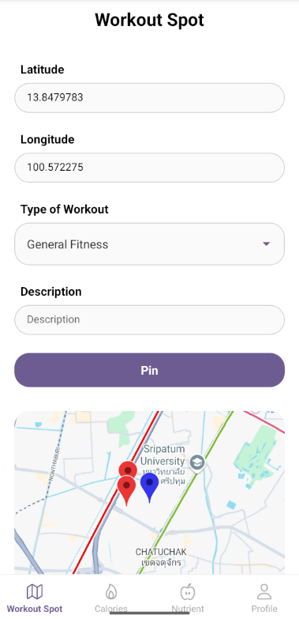

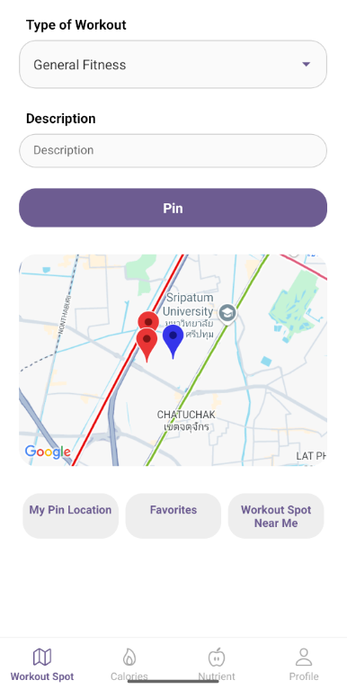

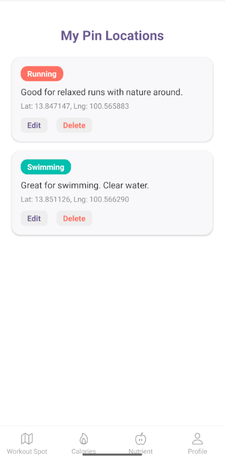


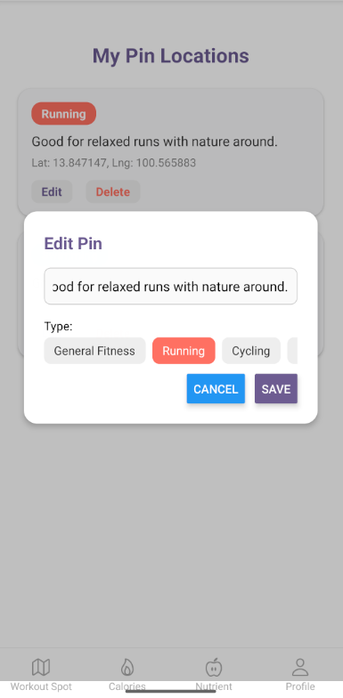


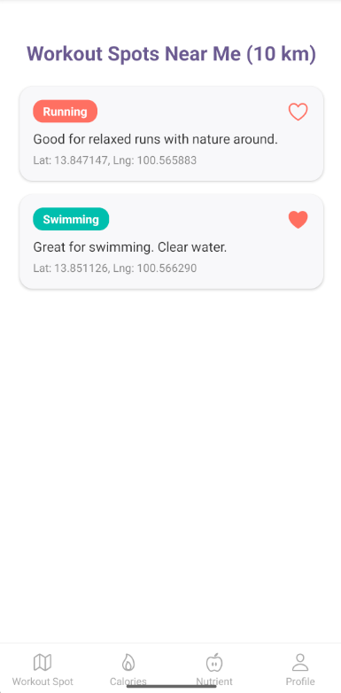

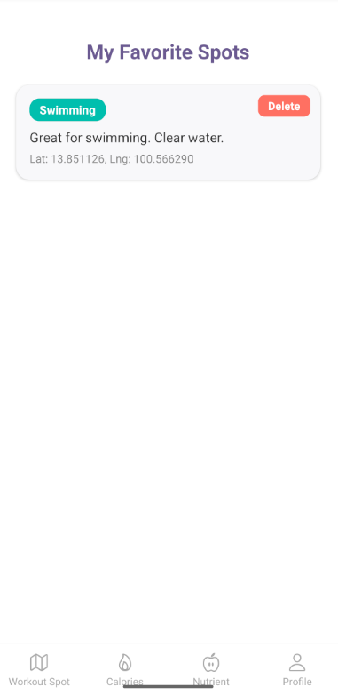


